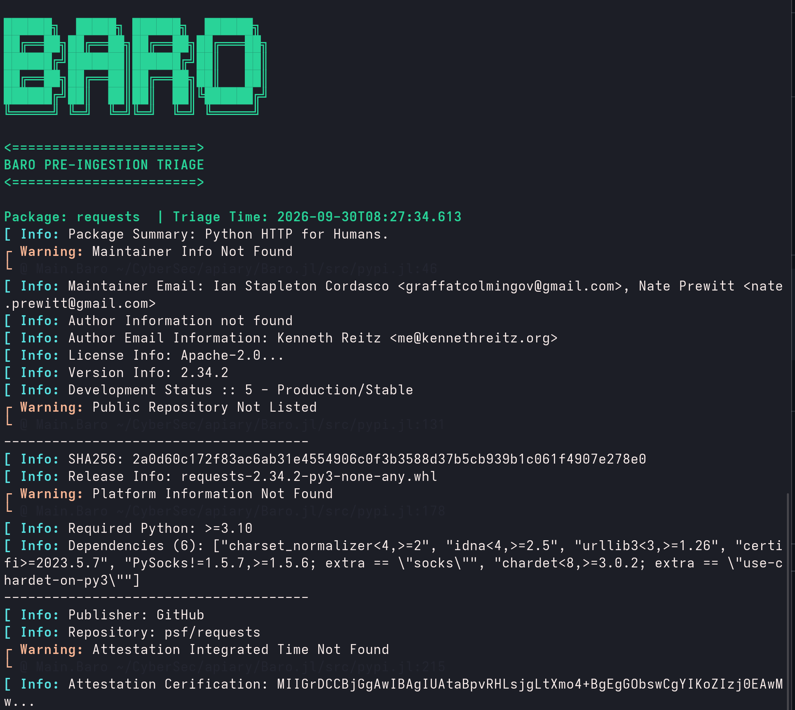

# BARO

```
██████╗  █████╗ ██████╗  ██████╗
██╔══██╗██╔══██╗██╔══██╗██╔═══██╗
██████╔╝███████║██████╔╝██║   ██║
██╔══██╗██╔══██║██╔══██╗██║   ██║
██████╔╝██║  ██║██║  ██║╚██████╔╝
╚═════╝ ╚═╝  ╚═╝╚═╝  ╚═╝ ╚═════╝ 
```

## BARO OSS Triage

> Baro checks the Barometer of package registries. It is a PyPi package security triaging tool. It finds license, author, release, version, dependencies and evidence of provenance. Supply Chain Security starts at the registry, therefore this tool helps address the key fields and requirements cybersecurity professionals need to know to make informed decisions before ingesting software.
---



## Dependencies
 - Julia 1.12
 - pkg add HTTP JSON3 Dates StyledStrings

## Usage
baro.jl [packages] [flags]

## Flags

| Flag | Description |
|------|-------------|
| `-md` | write a markdown report |
| `-json` | write ndjson for records and duckdb ingestion |
| `-h` | help |

## Examples
```
baro.jl requests click flask -md
baro.jl requests cifi -md -json
baro.jl botocore idna selenium # prints terminal output only
baro.jl -h # Will display help
```

## RoadMap
**Adding Support For More Registries**:
 - Npm
 - HuggingFace
 - Julia

 **Adding Features**:
 - OPA/Rego json rules for assessment
 - DuckDB documentation instuction for use with ndjson

---
